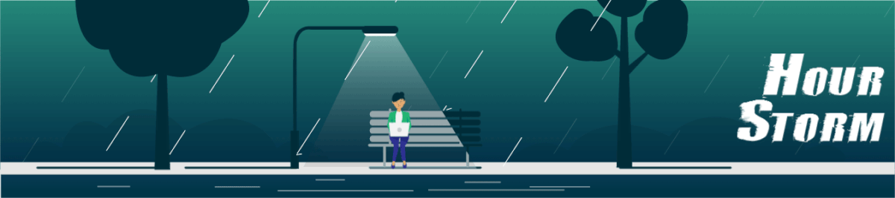

<h1 align="center">Hi 👋, I'm Arghyadeep Mukherjee</h1>
<h3 align="center">A passionate Full Stack Developer and Aspiring Ethical Hacker From India.</h3>

&nbsp;&nbsp;

&nbsp;&nbsp;

- 🌱 I’m currently learning **Kubernetes**

- 💬 Ask me about **Linux, Devops**

- 📫 How to reach me **arghyadeepbumbum@gmail.com**

- ⚡ Fun fact **I rice my linux desktop for leisure.**

  

